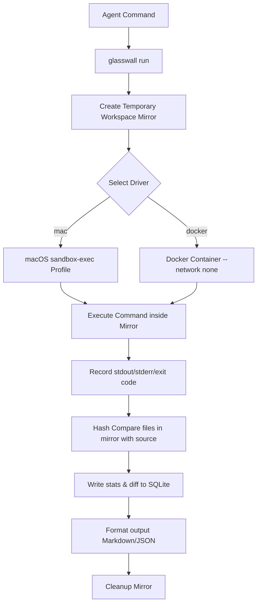

# GlassWall Sandbox


> A lightweight, local first agentic execution sandbox. Designed specifically for AI agents to run untrusted terminal commands safely, audit workspace mutations, prevent data exfiltration, and reflect on command execution.

---

## 💡 Why GlassWall?

AI agents with terminal access are incredibly powerful, but running arbitrary shell commands directly on a host machine is hazardous. An agent might run command-line tools that exfiltrate environment variables (like API keys), or introduce bugs that inadvertently corrupt the local codebase (e.g. `rm -rf $UNSET_VAR`).

`glasswall` acts as an **auditing firewall and execution container**. It lets agents dry-run commands on a mirrored copy of the workspace, blocks network access by default, checks for side effects, lists exactly what files changed, and saves the history in SQLite.

---

## 🛠 Features

* **Sub-millisecond Local Overhead:** Utilizes native macOS `sandbox-exec` profile sandboxing to isolate executions with near-zero latency compared to VMs or heavy container startup times.
* **Pluggable Drivers:** Use `sandbox-exec` (macOS native) or containerization via Docker (`--driver=docker`) interchangeably.
* **Workspace Mirroring:** Creates an ephemeral mirror of the active working directory, excluding heavy dependency maps (like `.git`, `node_modules`, `.venv`, `dist`, `.DS_Store`).
* **Precise Modification Diffing:** Identifies created, modified, and deleted files using SHA-256 comparison of file states before and after command execution.
* **Network Isolation:** Denies outbound network socket creation by default (`deny network-outbound`), protecting local environments from data leakages.
* **Agent-Optimized Output Modes:** 
  * Default markdown representation.
  * `--json` mode for easy programmatic consumption.
  * `--compact` mode to fit metrics into tight LLM token context windows.
* **SQLite Persistent History:** All run logs (exit codes, duration, console stdout/stderr, file lists) are saved in a local SQLite file (`~/.glasswall/runs.db`).

---

## 🚀 Getting Started

### Prerequisites
* **Go:** Version 1.26.3 or higher.
* **macOS:** Required if running the native `mac` driver (`sandbox-exec` profile sandbox).
* **Docker:** Required only if running command execution with the `--driver=docker` flag.

### Install
Compile and install the `glasswall` CLI locally:

```bash
# Clone or navigate to the repository directory
cd glasswall

# Build the binary
go build -o glasswall ./cmd/glasswall

# (Optional) Install to your go bin path to make it accessible globally
go install ./cmd/glasswall
```

---

## 📖 CLI Commands

### 1. `run` (Execute in Sandbox)
Spawns a shell command inside the sandbox. 

```bash
glasswall run "<command>" [flags]
```

#### Flags:
* `--driver`: Sandboxing engine to use: `mac` (native macOS profiles, default) or `docker`.
* `--network`: Allow outbound network access inside the sandbox (default is `false`).
* `--image`: The container image to run (default `alpine:latest`, only used when `--driver=docker`).
* `--compact`: Prints a single-line summary of exit codes and file modifications (ideal for LLM context optimization).
* `--json`: Outputs full run record in structured JSON format.
* `--db-path`: Custom SQLite database path (defaults to `~/.glasswall/runs.db`).

#### Examples:
```bash
# Run a simple file creation inside native Mac sandbox (network blocked)
glasswall run "echo 'hello world' > test.txt"

# Run dependency installation in Docker (network enabled)
glasswall run "npm install" --driver=docker --network

# Run compile check in compact agent mode
glasswall run "go build -o app ./cmd/app" --compact
```

### 2. `runs` (Query Run History)
Lists historical execution records stored in the SQLite database, ordered by start time.

```bash
# List history in Markdown format
glasswall runs

# List history in JSON format
glasswall runs --json
```

### 3. `diff` (Inspect Mutations)
Shows created, modified, or deleted files for a specific execution run.

```bash
glasswall diff <run-id>
```

---

## 📦 How it Works under the Hood



1. **Workspace Mirroring:** `glasswall` copies the active host folder files to `/private/tmp/glasswall-runs/<run-id>`. It skips common binaries/dependency maps (`.git`, `node_modules`, etc.).
2. **Containment:** 
   * **macOS:** Runs `sandbox-exec -p <profile> sh -c "<cmd>"`. The profile restricts file writes to the mirrored directory and standard Mac temp paths `/private/tmp`, `/private/var`, and `/var/folders`.
   * **Docker:** Starts container mounting the mirror directory to `/workspace` and runs `--network none` (unless bypassed).
3. **Hashing & Diffing:** After command completion, `glasswall` hashes all workspace mirror files and compares them with the host workspace files to discover mutations.
4. **State Storage:** Inserts run records containing timestamps, commands, exit codes, output streams, and JSON change arrays into the local runs DB.
5. **Cleanup:** Safely removes the mirrored workspace.

---

## 📝 License
This project is released under the PolyForm Noncommercial License 1.0.0. See the [LICENSE](LICENSE) file for details.
